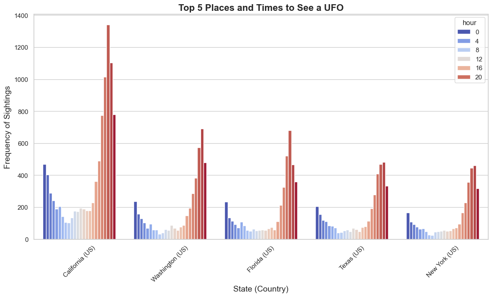

# UFO Sightings - Data Engineering & Analysis

## Project Overview

This project builds an ETL pipeline with PySpark to extract, clean, and load a Kaggle dataset about UFO sightings. Data analysis is done using Python, and charts are made for visualization.

## Links

https://www.kaggle.com/datasets/NUFORC/ufo-sightings

## Technologies

- Matplotlib
- Seaborne
- Pandas
- NumPy
- PostgreSQL
- PySpark

## Results

### Distribution of Dataset

### UFO Shapes & Frequency 

### Common Locations & Times

