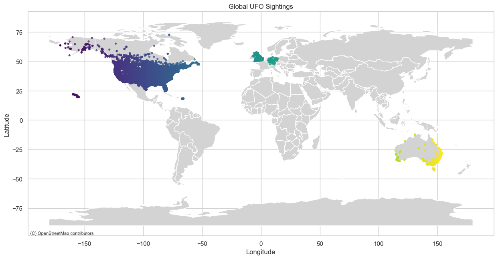
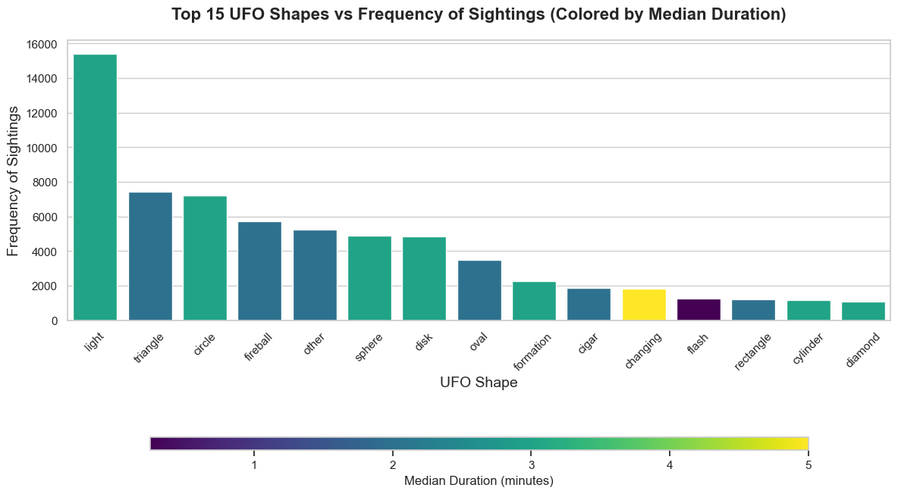

# UFO Sightings - Data Engineering & Analysis

## Project Overview

This project develops an ETL pipeline using PySpark to extract, transform, clean, and load a Kaggle dataset on UFO sightings. Data analysis is peformed, including worldwide geograpical distribution, sentiment analysis of witness reports, and an Austalian specific section.

## Links

https://www.kaggle.com/datasets/NUFORC/ufo-sightings

## Results





## Dataset Exploration

### Worldwide UFO Reports

1) How does the frequency of UFO sightings differ over time?
2) What is the geographic distribution of UFO sightings worldwide?
3) Based on historical data, what are the most likely places to see a UFO and at what time?
4) What is the most common appearance of UFO's and for how long is each type seen?

### Sentiment Analysis

5) Are the comments after a UFO sighting more negative or positive, on average?
6) What are the 20 most frequently used words in comments after UFO sightings by witnesses?
7) Are there commonalities between the profiles of people that are involved in UFO sightings?

### UFO Reports in Australia

8) What is the geographic distribution of UFO sightings in Australia?
9) Based on historical data, what are the most likely places to see a UFO in Australia and at what time?
10) What is the most common appearance of UFO's and for how long is each type seen?


## Technologies

- Anaconda
- Matplotlib
- Seaborne
- SQLAlchemy
- Pandas
- NumPy
- PostgreSQL
- PySpark

## Summary of Dataset on Kaggle

```text
UFO Sightings
Reports of unidentified flying object reports in the last century

About Dataset
Context
This dataset contains over 80,000 reports of UFO sightings over the last century.

Content
There are two versions of this dataset: scrubbed and complete. The complete data includes entries where the location of the sighting was not found or blank (0.8146%) or have an erroneous or blank time (8.0237%). Since the reports date back to the 20th century, some older data might be obscured. Data contains city, state, time, description, and duration of each sighting.

Inspiration
What areas of the country are most likely to have UFO sightings?
Are there any trends in UFO sightings over time? Do they tend to be clustered or seasonal?
Do clusters of UFO sightings correlate with landmarks, such as airports or government research centers?
What are the most common UFO descriptions?
```

## Contact Me
- Visit my [LinkedIn](https://www.linkedin.com/in/obj809/) for more details.
- Check out my [GitHub](https://github.com/cyberforge1) for more projects.
- Or send me an email at obj809@gmail.com
<br />
Thanks for your interest in this project. Feel free to reach out with any thoughts or questions.
<br />
<br />
Oliver Jenkins © 2024